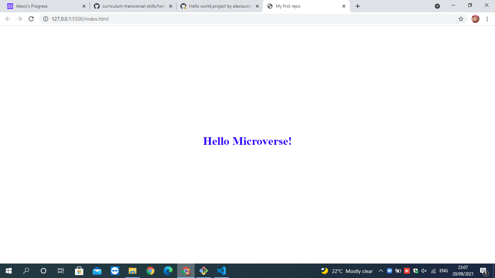

# Hello-world

> my first projecton microverse learning jouney

this project is made of home page developen in html and css

## Built With

- HTML 
- CSS
- No Frameworks used for this project
- 

## Live Demo

[Live Demo Link](https://livedemo.com)

## Getting Started

**This is an example of how you may give instructions on setting up your project locally.**
**Modify this file to match your project, remove sections that don't apply. For example: delete the testing section if the currect project doesn't require testing.**

To get a local copy up and running follow these simple example steps.

### Prerequisites

##- have a github account
##- create a github Repository
##- Have Internet connection
##- Computer

## Authors

👤 **Alexis UWIMANA**

- GitHub: [@githubhandle](https://github.com/alexisuwimana)
- Twitter: [@twitterhandle](https://github.com/alexisuwimana)
- LinkedIn: [LinkedIn](https://github.com/alexisuwimana)

## 🤝 Contributing

Contributions, issues, and feature requests are welcome!

Feel free to check the [issues page](../../issues/).

## Show your support

Give a ⭐️ if you like this project!

## Acknowledgments

- Hat tip to anyone whose code was used
- Inspiration
- etc

## 📝 License

This project is [MIT](./MIT.md) licensed.

